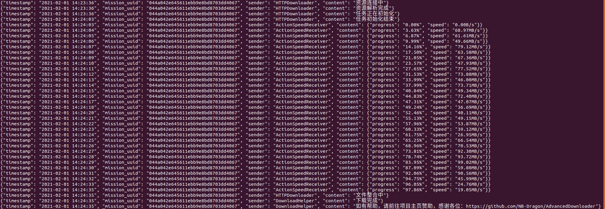

# AdvancedDownloader
Download everything with high speed. 
Project link: [https://github.com/NB-Dragon/AdvancedDownloader](https://github.com/NB-Dragon/AdvancedDownloader)

# Characteristic
1: Unlimited number of threads, depending on your PC configuration. 
2: Faster than **Wget**, **Curl**, **Aria2**, **Thunder** and **Browser**. 
3: Download project from **GitHub** with high speed. 
4: Download files from **Baidu Net Disk** with high speed.

# Ability
1: Effectively solve the problem of slow download speed. 
2: Effectively solve the problem of frequent resource interruption. 
3: Download the resource which requires authentication.

# Usage
1: Run command `pip install -r requirements.txt` 
2: Run command `python main.py` to start download. 
3: Program control commands can be found in [PROGRAMME_COMMAND](doc/PROGRAMME_COMMAND.md).

# System support
All systems which support Python3.

# License
GNU GENERAL PUBLIC LICENSE Version 3, 29 June 2007

# Download effect Test

# Project Schedule
- [ ] Operation page design.
- [ ] Application icon design.
- [x] HTTP/HTTPS protocol support.
- [ ] FTP/FTPS protocol support.
- [ ] Magnet protocol support.

# Donate
- Welcome to buy me a cup of coffee if you want. In return, I will make this project better. 
- You can see the list of donations so far at [PROJECT_DONATION.md](.github/PROJECT_DONATION.md). 
- Please note `GitHub-001-Username` for donation, such as `GitHub-001-Anonymous` 

