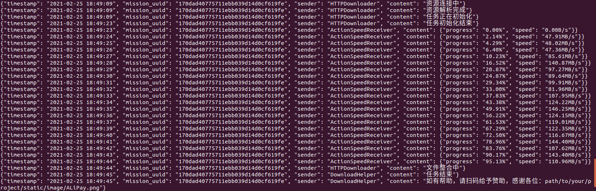

# AdvancedDownloader
Download everything with high speed. 
Project link: [https://github.com/NB-Dragon/AdvancedDownloader](https://github.com/NB-Dragon/AdvancedDownloader)

# Characteristic
1: Unlimited number of threads. 
2: Faster than **Aria2**, **Thunder** and **Browser**. 
3: Download project from **GitHub** with high speed. 
4: Download files from **Baidu Net Disk** with high speed.

# Skill
1: Effectively solve the problem of slow download speed. 
2: Effectively solve the problem of frequent resource interruption. 
3: Download the resource which requires authentication.

# Usage
1: Run command `pip install -r requirements.txt` 
2: Modify the values of `headers` and `url` in `main.py`. 
3: Run command `python main.py` to start download.

# Download Test

# System support
All systems which support Python3.

# Project Schedule
- [ ] Operation page design.
- [ ] Application icon design.
- [x] HTTP/HTTPS protocol support.
- [ ] FTP protocol support.
- [ ] Magnet protocol support.

# License
GNU GENERAL PUBLIC LICENSE Version 3, 29 June 2007

# Donate
- Welcome to buy me a cup of coffee if you want. In return, I will make this project better. 
- All donations will be written into the contribution list file. 
- Please note `GitHub-001-Username` for donation, such as `GitHub-001-Anonymous` 

